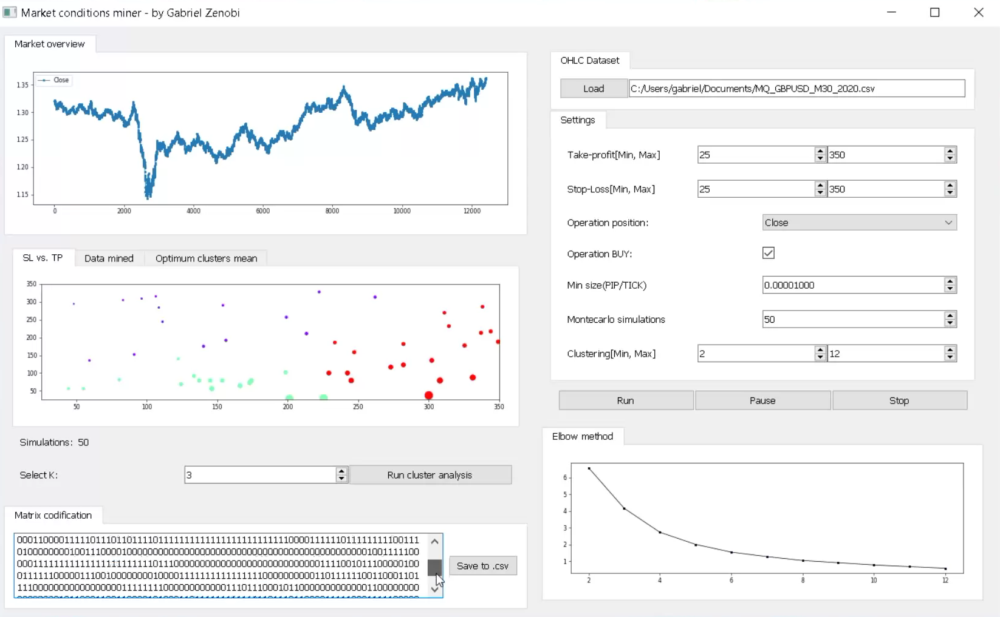

This is a real-time demo of the market conditions miner. An application I've been working on, created with the intention of mining the best (ideal) market conditions based on profit-loss. It uses an expert algorithm totally designed by me, Monte Carlo simulations and an artificial intelligence algorithm known as K-Means, it also applies a mathematical formula that I developed specifically for this method, with which it selects the best cluster based on the characteristics mentioned above.

It encodes all the information to a matrix of states which has the purpose of being exported to some other artificial intelligence algorithm such as DecisionTree, Lazy Learning, Ensemble learning, among others... (depending on the problem to be solved). In this case the application seeks to create, from this method, an expert trading system which takes the best decisions (from a mathematical point of view).

This application was designed after a data science work that I did, in which I explain all the formulas and the mathematical analysis that I apply, after the experimental phase I decided that it would be a good idea to automate everything in an interface to make the method more accessible to anyone... The article will be published later!.

The main idea is to make a toolkit to analyze and create trading strategies, based on machine learning and stochastic processes(their analysis and use for mathematical models).

Market conditions miner allows:
 
[+] Load historical price files with OHLC structure.
 
[+] Make an overview of the market to be mined.
 
[+] A configuration system with which it is possible to select; target profit-loss range, trade type (buy or sell), trade positioning (OnClose or OnOpen method), minimum market displacement, Monte Carlo simulations and Clustering range to optimize.
 
[+] SL vs. TP - Tab: which allows to see in real time the mining done by the Monte Carlo simulation. It shows a scatterplot with different sizes which represent the frequency of operations.
 
[+] Data mined - Tab: allows us to see analytically in real time the mining done by the montecarlo simulation, it also allows us to save everything in a csv file in case we want to use it for our own purposes.
 
[+] Optimum clusters mean - Tab: shows us the averages of the selected clusters after finishing the simulation. It also allows to save everything in a csv file in case we want to use it for our own purposes.
 
[+] Run cluster analysis: Runs a K-means analysis after finishing all the simulations to classify the selected clusters (K-Param).
 
[+] Matrix codification: Final part of the pattern search heuristic, it codifies all the information to a binary matrix which allows to save it in a csv file, this is very important because with it we will create the trading system (based on some other artificial intelligence method).
 
[+] Elbow method: Calculates the inertia of the K-Means to show the K-optimal parameter to select(if desired).

# Real time demo on my YT channel

https://youtu.be/FmJYnlSURn4

# Presentation

